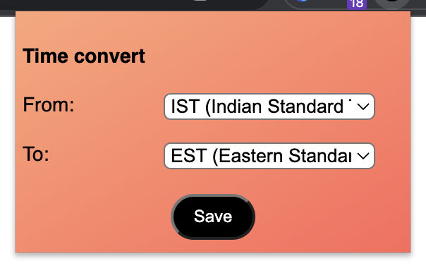
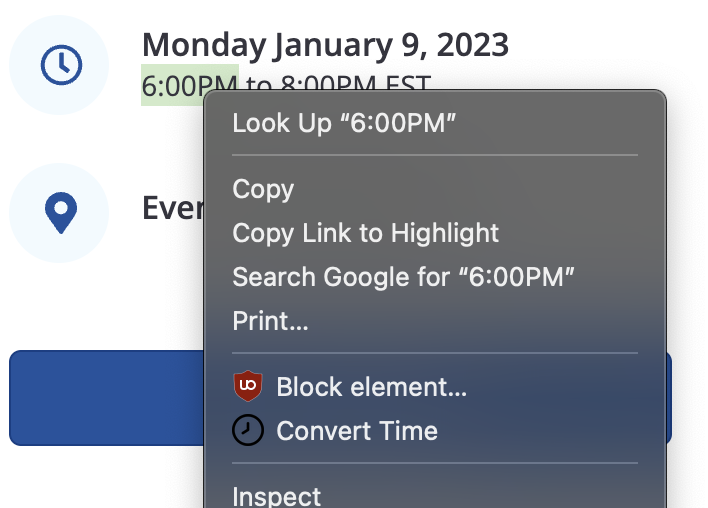

<h1>Time Converter (Chrome Extension) &nbsp;   &nbsp; 
</h1>

---

This is a simple chrome-extension that will convert time from one timezone to other.

> This is just a free time project and there may be bugs.

### Ussage
 - Select the `From` and `To` timezones in the extension popup.
 - Select the text (Time ex: 3:00PM) on a webpage and click on convert time from `right click` menu.
 - You will see a notification of the converted time in the 24hr format.

#### Images



#### Installation
- ```git clone https://github.com/reach-the-sky/Time-Convert.git``` <br>
- Enable Developer mode in Chrome.
- Load the project as `unpacked project` from `manage extensions` in chrome.

If you liked my project and appreciate the content I opensource, consider following me on github [🌥](https://github.com/reach-the-sky).
